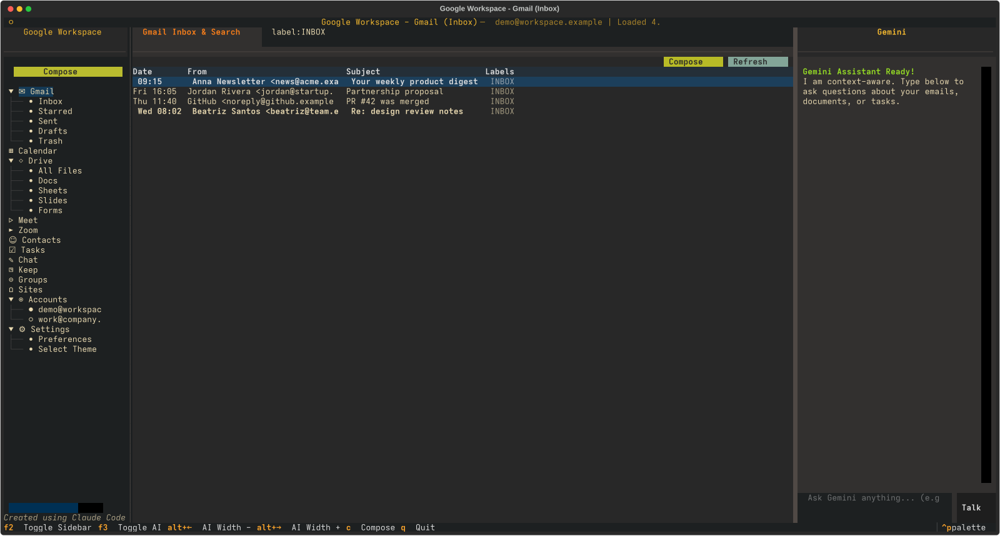

# GogMail TUI

[](https://github.com/olafkfreund/gogmail/actions/workflows/ci.yml)
[](LICENSE)
[](https://olafkfreund.github.io/gogmail/)
[](https://claude.com/claude-code)

A modern, premium, feature-rich Terminal User Interface (TUI) client for Linux that brings Google Workspace and Zoom services directly into your terminal.

**Showcase & blog: [olafkfreund.github.io/gogmail](https://olafkfreund.github.io/gogmail/)**



## Key Features

- **Integrated Services**: Contains specialized dashboards for:
  - **Gmail**: Read, search (**paginated — load more**), archive, trash, compose, reply, **star, apply labels, save drafts, download attachments, and view inline images** (embedded images shown in-client; remote images opt-in to block tracking pixels); recipient autocomplete from contacts.
  - **Calendar**: Agenda view, details panel, RSVP, create/**edit**/delete events, a **multi-calendar picker** and **free/busy** lookup. Compose/edit opens as a **right-docked panel with a fullscreen toggle**.
  - **Drive**: Browse, search, upload, download, create folders, delete, **share, rename, and move**; **inline image preview** pane; click a file to open it in the browser.
  - **Docs, Sheets, Slides, Forms**: Interactive lists, read/cat Docs, render Sheets in a grid with **inline cell editing and row append**, open in the browser, create new files.
  - **Meet**: Instantly create video conference spaces and copy links.
  - **Zoom**: **Create instant meetings** that launch your Zoom client, plus validate Server-to-Server OAuth.
  - **Contacts & People**: Fast search and details card; **create, edit and delete** contacts; resolves real names in Chat.
  - **Tasks**: Multiple task lists; add, **edit, set due dates**, complete/incomplete, delete, and **clear completed**.
  - **Chat**: Real-time spaces listing, messages history (with real participant names), and sending text chats.
  - **Keep**: List notes, create and delete them.
  - **Groups**: List your Google Groups and their members.
  - **Backup**: Export your account into an encrypted backup (`gog backup`) from the Settings page.
  - **Photos · YouTube · Classroom · Sites**: read-only tabs (Photos shows **inline thumbnails**). Photos/YouTube/Classroom each need their own Google API enabled, so they're **opt-in via Settings** (off by default); Sites is always on.
- **AI Integration (Gemini)**:
  - Toggleable, context-aware side panel — it sees the selected email, open doc, or task list.
  - **Agentic read + act tools**: "show me my latest emails", "what's on my calendar this week", "what are my open tasks", "find the doc about X", "draft a reply" — it fetches the data via `gog`, summarizes it, **and opens the matching client view** populated with the results.
  - Email composing helper that writes replies/drafts directly from your instructions.
  - **Write-action tools**: save a draft, star/label an email, share a file, edit an event, switch account, create a task list — all by asking.
  - **Pluggable backend**: the AI layer is behind an `LLMProvider` abstraction (`GOGMAIL_LLM_PROVIDER`), defaulting to Gemini.
  - **Voice control** (optional): push-to-talk mic button transcribes speech to drive the assistant, with optional **spoken replies** in Google's natural Gemini TTS voice (espeak fallback). Toggle both in the new **Settings** page.
- **Visual Aesthetics**: Clean, responsive layout with six switchable themes; single-width sidebar markers by default, with an optional **monochrome icon** set (toggle in Settings).

---

## Prerequisites

1. **gog CLI**: The local CLI tool `gog` must be installed and authenticated. Check status by running `gog status` or list authenticated accounts via `gog auth list`.
2. **Gemini API Key**: Make sure the `GEMINI_API_KEY` environment variable is exported.
3. **Devenv & Nix**: A local `devenv` installation to manage Python and TUI libraries.

---

## Installing

- **NixOS / Nix**: `nix run github:olafkfreund/gogmail`, or use the flake's NixOS / Home Manager modules — see [`nixos_install.md`](nixos_install.md).
- **Debian / Ubuntu**: `sudo apt install ./gogmail_<ver>_all.deb`
- **Fedora / RHEL / openSUSE**: `sudo dnf install ./gogmail-<ver>.noarch.rpm`
- **Any Linux**: run the self-contained zipapp directly — `python3 gogmail.pyz` (needs `python3 >= 3.10`).

The `.deb`/`.rpm`/zipapp, an **SBOM** (CycloneDX + SPDX), **vulnerability/dependency scan** reports, and a **cosign-signed `SHA256SUMS`** are attached to each [GitHub release](https://github.com/olafkfreund/gogmail/releases). They bundle GogMail's Python deps but contain **no secrets**; how they're built and how to verify them is documented in [`PACKAGING.md`](PACKAGING.md). All packages require the [`gog` CLI](https://github.com/steipete/gogcli) on PATH.

## Getting Started

### Using Devenv & Just (Recommended)

Start the TUI with a single command:
```bash
just run
```

### Alternatively, Enter Shell and Run Manually

```bash
devenv shell
python -m gogmail.app
```

---

## Key Bindings

- `q`: Quit the application.
- `F2` (or `ctrl + b`): Toggle left sidebar (Workspace Navigator).
- `F3` (or `alt + a`): Toggle right AI assistant panel.
- `alt + ←` / `alt + →` (or `alt + h` / `alt + l`): Resize the AI panel.
- `tab` / `shift + tab`: Move focus between widgets.
- `↑ / ↓`: Navigate lists, tables, and the sidebar tree.
- `enter`: Select items (in lists, email tables, etc.) or submit forms/chats.

Everything is fully **keyboard-driven** (Textual handles tab/arrow/enter focus
and navigation) **and mouse-driven** (click the sidebar, rows, and buttons;
drag the divider between the content and the AI panel to resize).

## Running in tmux

GogMail works in tmux. Two notes:

- **Mouse:** enable it in your tmux config so clicks/scroll/drag reach the app:
  ```tmux
  set -g mouse on
  ```
- **Sidebar key:** `ctrl+b` is the default tmux prefix and is swallowed by tmux,
  so use **`F2`** to toggle the sidebar (and `F3` for the AI panel) inside tmux.
- **Colors:** use a truecolor terminal; if colors look off, add
  `set -ga terminal-overrides ",*:Tc"` to your tmux config.

---

## Configuration

Settings persist to `~/.config/gogmail/settings.json` (theme, AI-panel width, last account).
The active Google account is detected from `gog status` at launch; set `GOG_ACCOUNT` to pin one.

On startup GogMail runs a preflight check — if the `gog` CLI is missing or not
authenticated, you'll get a clear, actionable message instead of silently empty
views. Any `gog` command failure during use is surfaced as an error toast rather
than looking like "no data".

---

## Development

```bash
just run     # launch the TUI
just test    # run the unit-test suite (unittest)
just lint    # syntax check (py_compile)
```

---

<p align="center"><sub>Created using <a href="https://claude.com/claude-code">Claude Code</a></sub></p>
